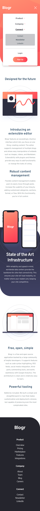
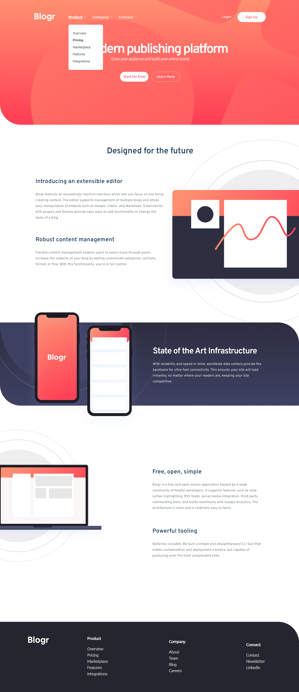

# Frontend Mentor - Blogr landing page

Esta é uma solução para o desafio [Desafio Blogr landing page no Frontend Mentor](https://www.frontendmentor.io/challenges/blogr-landing-page-EX2RLAApP). Os desafios do Frontend Mentor ajudam a melhorar suas habilidades de codificação através da construção de projetos realistas.

# Índice

- [Resumo](#resumo)
  - [Desafio](#desafio)
  - [Screenshot](#screenshot)
  - [Links](#links)
- [Processo](#processo)
  - [Construção](#construção)
  - [Aprendizado](#aprendizado)
- [Recursos](#recursos)
- [Autor](#autor)

<br>

# Resumo

## Desafio

<br>

A aplicação consiste em uma landing page responsiva que inclui um menu hambúrguer e dropdown que se adaptam automaticamente conforme as dimensões do dispositivo utilizado. Além da página principal, foi adicionada uma página de login e sign up, que inclui validação de formulário para garantir que as informações inseridas pelos usuários sejam corretas.

Os usuários devem ser capazes de:

- Visualizar o layout ideal para o site, dependendo do tamanho da tela do dispositivo;
- Estados de foco para todos os elementos interativos na página.

<br>

## Screenshot

-  **Mobile**

<p style="text-align:center">
    </img>
</p>

<br>

- **Desktop**

<p style="display:inline; margin: 20px">
    </img>
</p>

<br>

## Links

- Site: [Blogr](https://08-blogr-landing-page.vercel.app);

<br>

# Processo

## Construção

<br>

- **HTML:**
  - Marcação semântica;
  - Metodologia BEM.
- **Sass:**
  - Divisão de responsabilidade em diferentes arquivos;
  - Variáveis;
  - Flexbox;
  - Grid;
  - Elementos interativos.
- **JavaScript:**
  - Divisão de responsabilidade em diferentes arquivos;
  - Exibição de menus;
  - Validação de formulário;
  - Sistema de diferente visibilidade para senhas;
  - Sistema carrossel.

<br>

## Aprendizado

<br>

### **HTML**

<br>

A utilização da tag ```<div>``` me permitiu personalizar sobreposições de imagens de fundo com a propriedade CSS ```background-image:```. Além disso, criei marcações HTML que possibilitam a alteração dinâmica de imagens, utilizando as tags ```<picture>```, ```<source>``` e ``````. Essa técnica me ajudou a garantir que a imagem apresentada fosse a mais adequada para a tela do dispositivo utilizado pelo usuário, melhorando assim a experiência do usuário.

Outro ponto que destaco é a utilização da metodologia BEM para organizar o CSS em blocos, elementos e modificadores. Isso me ajudou a manter o código mais organizado e legível, evitando conflito de nomenclatura e mantendo a consistência no código.

No geral, estou muito satisfeito com o resultado deste projeto e sinto que aprendi muito ao colocar em prática técnicas e metodologias para desenvolvimento web mais eficientes e profissionais.

<br>

***Utilizar ```<div>``` para criar a sobreposição***

``` html
<header class="header">

        <div class="header__gradient" aria-label="Gradient"></div>

        <section class="header__background" aria-label="Background pattern intro">
        ...
        </section>
```

<br>

***Utilizar tags semânticas para alteração dinâmica de imagens***

``` html
    <header>
        <a href="../index.html">
            <picture>
                <source media="(min-width: 1019px)" srcset="../assets/images/logo-blue.svg">
                
            </picture>
        </a>
    </header>
```

<br>

***Metodologia BEM***

``` html
<footer class="footer">

        

        <nav class="footer__nav">

            <ul class="nav__list">
                <li class="nav__item--main">Product</li>
                <li class="nav__item">Overview</li>
                <li class="nav__item">Pricing</li>
                <li class="nav__item">Marketplace</li>
                <li class="nav__item">Features</li>
                <li class="nav__item">Integrations</li>
            </ul>

            <ul class="nav__list">
                <li class="nav__item--main">Company</li>
                <li class="nav__item">About</li>
                <li class="nav__item">Team</li>
                <li class="nav__item">Blog</li>
                <li class="nav__item">Careers</li>
            </ul>

            <ul class="nav__list">
                <li class="nav__item--main">Connect</li>
                <li class="nav__item">Contact</li>
                <li class="nav__item">Newsletter</li>
                <li class="nav__item">LinkedIn</li>
            </ul>

        </nav>
    </footer>
```

<br>

---

### **SCSS**

<br>

Este é o meu primeiro projeto utilizando pré-processadores e estou muito satisfeito e realizado por conseguir colocar em prática conhecimentos adquiridos por cursos online. A utilização de pré-processadores como SASS permite criar estilos de forma mais fácil e eficiente, possibilitando a aninhamento de elementos, a utilização de ```mixins``` e a compilação de diferentes páginas em um único arquivo destino. Isso torna o código mais organizado e modular, permitindo a divisão em diferentes arquivos, resultando em arquivos menores, mais fáceis de entender e editar. Sinto que o uso de pré-processadores é uma ferramenta essencial para aumentar a eficiência no desenvolvimento de projetos web e estou animado para continuar explorando suas possibilidades.

<br>

***Arquivo destino responsavel por compilação***

``` scss
@use './abstract/root';
@use './abstract/global';
@use './elements-index/header';
@use './elements-index/main';
@use './elements-index/footer';
@use './elements-index/responsive';
 ```

<br>

***Utilizar ```mixin```***

``` scss
@mixin text($family, $size, $weight, $letter, $line, $color, $align, $display) {
    font-family: $family;
    font-size: $size;
    font-weight: $weight;
    letter-spacing: $letter;
    line-height: $line;
    color: $color;
    text-align: $align;
    display: $display;
}
```

***Aninhamento de elementos***

``` scss
.third {
        @include background-image("../images/illustration-laptop-mobile.svg", center 6rem, 49.8rem, no-repeat);
        padding: 45.6rem 2.3rem 9.4rem 3.4rem;
        width: 100vw;

        .copy {
            display: flex;
            flex-wrap: wrap;
            justify-content: center;
            gap: 4rem;

            .copy__area {
                display: flex;
                flex-wrap: wrap;
                justify-content: center;
                gap: 2.4rem;

                .copy__title {
                    @include text($overpass, $size28, $o-w6, 0.01em, normal, $primary-very-dark-blue, center, block);
                    width: 100%;

                }

                .copy__text {
                    @include text($overpass, $size16, $o-w3, 0.03em, 2.8rem, $neutral-very-dark-grayish-blue,center, block);
                    max-width: 44.8rem;

                }
            }
        }
    }
 ```

<br>

---

### JavaScript

<br>

Durante o desenvolvimento do projeto, utilizei diversas propriedades e eventos do JavaScript para criar um sistema interativo e eficiente. Para alternar a exibição do menu hambúrguer  e do menu dropdown, utilizei a propriedade ```element.classList.toggle```, permitindo que o usuário possa exibir ou ocultar o menu de acordo com sua necessidade. Também adicionei uma verificação que permite exibir apenas uma opção por vez no menu dropdown.

Para identificar qual elemento foi clicado e deve ser exposto, utilizei o método ```forEach``` em conjunto com o método ```nextElementSibling``` para facilitar a seleção de elementos relacionados ao pai para interação. Além disso, adicionei um evento responsável por fechar os menus após um clique em qualquer posição do ```body```, utilizando a propriedade event.target.closest.

Para validar os campos do formulário, utilizei os eventos ```blur``` e ```invalid```. O evento ```blur``` permite verificar qual elemento perdeu o foco e começar a validação, enquanto o evento ```invalid``` bloqueia o funcionamento padrão do navegador, permitindo a exibição de mensagens personalizadas para diferentes tipos de erros pré-selecionados da propriedade ```ValidityStates```. Para garantir uma melhor experiência para o usuário, incluí mensagens claras e precisas para cada tipo de erro. Após a validação e aprovação do formulário, todo o conteúdo é salvo no ```localStorage```.

Também implementei um sistema de exibição da digitação do ```input``` password, que altera o tipo do ```input``` de ```password``` para ```text``` através de um operador ternário. Adicionei um sistema de slide que se altera automaticamente a partir de um tempo pré-definido pelo método ```setInterval``` ou através do menu de navegação, proporcionando uma experiência mais dinâmica para o usuário.

<br>

***Funções com propriedade ```element.classList.toggle```***
``` javascript
function changeVisibility() {
  navBar.classList.toggle("--active");
  iconMenu.classList.toggle("--hide");
  iconCloseMenu.classList.toggle("--active");
}
```

``` javascript
function toggleDropdown(dropdownLink, dropdownList, arrowLight, arrowDark) {
  dropdownLink.classList.toggle("--active");
  dropdownList.classList.toggle("--active");
  arrowLight.classList.toggle("--rotate");
  arrowDark.classList.toggle("--rotate");
}
```

<br>

***Utilização da propriedade ```element.forEach()```***
``` javascript
dropdownLinks.forEach((dropdownLink) => {
  const dropdownList = dropdownLink.nextElementSibling; 
  const arrowLight = dropdownLink.querySelector(".dropdown__icon"); 
  const arrowDark = dropdownLink.querySelector(".dropdown__icon--dark"); 

  dropdownLink.addEventListener("click", (e) => {
    e.preventDefault();
    dropdownLinks.forEach((link) => {
      if (link !== dropdownLink && link.classList.contains("--active")) {
        link.classList.remove("--active");
        link.nextElementSibling.classList.remove("--active");
        link.querySelector(".dropdown__icon").classList.remove("--rotate");
      }
    });

    toggleDropdown(dropdownLink, dropdownList, arrowLight, arrowDark);
  });
});
```

<br>

***Pré-seleção dos erros e mensagens personalizadas***
``` javascript
inputs.forEach((input) => {
  input.addEventListener("blur", () => checkInputs(input));
  input.addEventListener("invalid", (e) => e.preventDefault());
});

const errorTypes = [
  "valueMissing",
  "typeMismatch",
  "patternMismatch",
  "tooShort",
];

const messages = {
  email: {
    valueMissing: "The email field cannot be empty",
    patternMismatch: "Please fill in a valid email address",
    tooShort: "Please fill in a valid email address",
  },
  password: {
    valueMissing: "The password field cannot be empty",
    patternMismatch:
      "The password must contain at least 8 characters, including: 1 uppercase, 1 lowercase, 1 numeric and 1 special character",
    tooShort: "The password must be at least 10 characters long",
  },
};
```

<br>

***Utilização do operador ternário para simplificar o código***
``` javascript
function changeIcon() {
    iconHidden.classList.toggle("--hidden");
    iconExposed.classList.toggle("--exposed");
    password.setAttribute("type", password.getAttribute("type") === "password" ? "text" : "password");
}
```

<br>

***Programação de tempo para exibição e calculo para identificar qual o proximo slide deve ser ativo***
``` javascript
const nextSlide = () => {
  removeActive();
  currentSlide = (currentSlide + 1) % slides.length;
  addActive();
};

nextBtn.addEventListener("click", nextSlide);

prevBtn.addEventListener("click", () => {
  removeActive();
  currentSlide = (currentSlide - 1 + slides.length) % slides.length; 
  addActive();
});

setInterval(nextSlide, 10000);
```

<br>

# Recursos

### HTML
- [BEM: guia definitivo do padrão CSS mais famoso](https://desenvolvimentoparaweb.com/css/bem/)
- [picture](https://developer.mozilla.org/en-US/docs/Web/HTML/Element/picture)

<br>

### Sass / Scss
- [Variáveis](https://sass-lang.com/documentation/variables)
- [Mixins](https://sass-lang.com/documentation/at-rules/mixin)

<br>

### JavaScript
- [element.classList.toggle](https://developer.mozilla.org/en-US/docs/Web/API/Element/classList)
- [forEach()](https://developer.mozilla.org/en-US/docs/Web/JavaScript/Reference/Global_Objects/Array/forEach)
- [element.nextElementSibling](https://developer.mozilla.org/en-US/docs/Web/API/Element/nextElementSibling)
- [event.target](https://developer.mozilla.org/pt-BR/docs/Web/API/Event/target)
- [event.target.closest](https://developer.mozilla.org/en-US/docs/Web/API/Element/closest)
- [blur event](https://developer.mozilla.org/en-US/docs/Web/API/Element/blur_event)
- [invalid event](https://developer.mozilla.org/en-US/docs/Web/API/HTMLObjectElement/invalid_event)
- [ValidityStates](https://developer.mozilla.org/en-US/docs/Web/API/ValidityState)
- [localStorage.setItem](https://developer.mozilla.org/en-US/docs/Web/API/Storage/setItem)
- [JSON.stringify](https://developer.mozilla.org/en-US/docs/Web/JavaScript/Reference/Global_Objects/JSON/stringify)
- [element.reset()](https://developer.mozilla.org/en-US/docs/Web/API/HTMLFormElement/reset)
- [window.location.href](https://developer.mozilla.org/en-US/docs/Web/API/Location)
- [setInterval](https://developer.mozilla.org/en-US/docs/Web/API/WindowOrWorkerGlobalScope/setInterval)
- [Operador ternário](https://developer.mozilla.org/en-US/docs/Web/JavaScript/Reference/Operators/Conditional_Operator)

# Autor

- Site pessoal - [Mathews Mattar](https://www.linkedin.com/in/mathewsmattar/)
